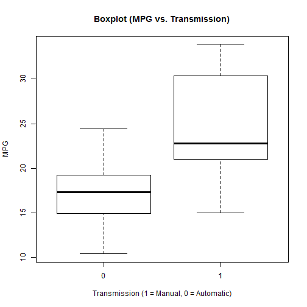
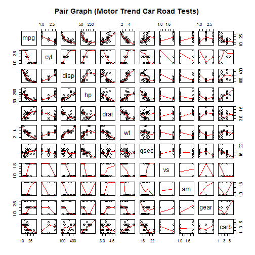
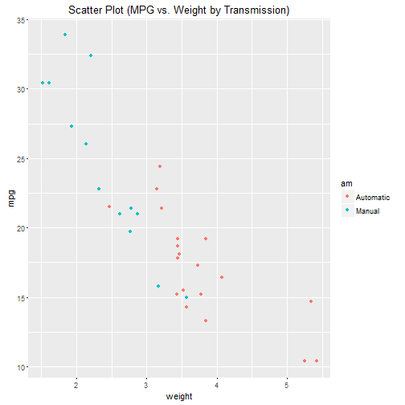
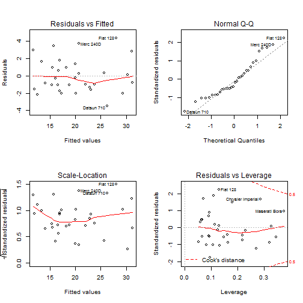

Regression Models Course Project - Effects of automatic/manual transmission on MPG
==========================================
#### Atit Doctor
##### February 24, 2016


## Executive Summary  
This project has been performed to fulfil the requirements for the course Regression Models offered by the Johns Hopkins University on Coursera. In this project, we will analyze the mtcars data set and explore the relationship between a set of variables and miles per gallon (MPG).

The main objectives of this research are as follows

* Is an automatic or manual transmission better for MPG?
* Quantifying how different is the MPG between automatic and manual transmissions?


The key takeaways from the analysis will be

* Manual transmission is better for MPG by a factor of 1.8 compared to automatic transmission.
* Means and medians for automatic and manual transmission cars are significantly different.


## Exploratory Data Analysis  
First, we load the data set `mtcars` and change the data type of variables from `numeric` to `factor`.


```r
library(ggplot2)
data(mtcars)
mtcars[1:3, ] # Sample Data
```

```
##                mpg cyl disp  hp drat    wt  qsec vs am gear carb
## Mazda RX4     21.0   6  160 110 3.90 2.620 16.46  0  1    4    4
## Mazda RX4 Wag 21.0   6  160 110 3.90 2.875 17.02  0  1    4    4
## Datsun 710    22.8   4  108  93 3.85 2.320 18.61  1  1    4    1
```

```r
dim(mtcars)
```

```
## [1] 32 11
```

```r
mtcars$cyl <- as.factor(mtcars$cyl)
mtcars$vs <- as.factor(mtcars$vs)
mtcars$am <- factor(mtcars$am)
mtcars$gear <- factor(mtcars$gear)
mtcars$carb <- factor(mtcars$carb)
attach(mtcars)
```

```
## The following objects are masked from mtcars (pos = 3):
## 
##     am, carb, cyl, disp, drat, gear, hp, mpg, qsec, vs, wt
```

```
## The following objects are masked from mtcars (pos = 6):
## 
##     am, carb, cyl, disp, drat, gear, hp, mpg, qsec, vs, wt
```

```
## The following object is masked from package:ggplot2:
## 
##     mpg
```

Now, we do some basic exploratory data analysis. According to the box plot, we see that manual transmission yields higher values of MPG in general. And as for the pair graph, we can see higher correlations between variables like "wt", "disp", "cyl" and "hp".


## Inference  
At this step, we make the null hypothesis as the MPG of the automatic and manual transmissions are from the same population (assuming the MPG has a normal distribution). We use the two sample T-tests to show it.  


```r
result <- t.test(mpg ~ am)
result$p.value
```

```
## [1] 0.001373638
```

```r
result$estimate
```

```
## mean in group 0 mean in group 1 
##        17.14737        24.39231
```

Since the p-value is 0.00137, we reject our null hypothesis. Which means that the automatic and manual transmissions are from different populations. And the mean for MPG of manual transmitted cars is about 7 units more than that of automatic transmitted cars.  


## Regression Analysis  

First, we fit the full model as the following. 


```r
fullModel <- lm(mpg ~ ., data=mtcars)
summary(fullModel) 
```

This model has the Residual standard error as 2.833 on 15 degrees of freedom. And the Adjusted R-squared value is 0.779

This means that the model can explain about 78% of the variance of the MPG variable. However, none of the coefficients are significant at 0.05 significant level.  

Now, we use backward selection to select some statistically significant variables.


```r
stepModel <- step(fullModel, k=log(nrow(mtcars)))
summary(stepModel)
```

This model is "mpg ~ wt + qsec + am". It has the Residual standard error as 2.459 on 28 degrees of freedom. And the Adjusted R-squared value is 0.8336, and this means that the model can explain about 83% of the variance of the MPG variable. All of the coefficients are significant at 0.05 significant level.    

Please refer to the **Appendix: Figures** section for the plots again. According to the scatter plot, it indicates that there appears to be an interaction term between "wt" variable and "am" variable, since automatic cars tend to weigh heavier than manual cars. Thus, we have the following model including the interaction term:  


```r
amIntWtModel<-lm(mpg ~ wt + qsec + am + wt:am, data=mtcars)
summary(amIntWtModel) 
```

This model has the Residual standard error as 2.084 on 27 degrees of freedom. And the Adjusted R-squared value is 0.8804, which means that the model can explain about 88% of the variance of the MPG variable. All of the coefficients are significant at 0.05 significant level. This model is by far the most explanatory one.  

Next, we fit the simple model with MPG as the outcome variable and Transmission as the predictor variable.  


```r
amModel<-lm(mpg ~ am, data=mtcars)
summary(amModel)
```

It shows that on average, a car has 17.147 mpg with automatic transmission, and if it is manual transmission, it increases by 7.2 mpg. 

This model has the Residual standard error as 4.902 on 30 degrees of freedom. And the Adjusted R-squared value is 0.3385, which means that the model can explain about 34% of the variance of the MPG variable. The low Adjusted R-squared value also indicates that we need to add other variables to the model.  

Final Model,  


```r
anova(amModel, stepModel, fullModel, amIntWtModel) 
confint(amIntWtModel)
```

We end up selecting the model with the highest Adjusted R-squared value, "mpg ~ wt + qsec + am + wt:am".  


```r
summary(amIntWtModel)$coef
```

```
##              Estimate Std. Error   t value     Pr(>|t|)
## (Intercept)  9.723053  5.8990407  1.648243 0.1108925394
## wt          -2.936531  0.6660253 -4.409038 0.0001488947
## qsec         1.016974  0.2520152  4.035366 0.0004030165
## am1         14.079428  3.4352512  4.098515 0.0003408693
## wt:am1      -4.141376  1.1968119 -3.460340 0.0018085763
```

Thus, the result shows that when "wt" (weight lb/1000) and "qsec" (1/4 mile time) remain constant, cars with manual transmission add 14.079 + (-4.141)*wt more MPG (miles per gallon) on average than cars with automatic transmission. 

For example, a manual transmitted car that weighs 2000 lbs have 5.797 more MPG than an automatic transmitted car that has both the same weight and 1/4 mile time.  


## Residual Analysis and Diagnostics  
Please refer to the **Appendix: Figures** section for the plots. According to the residual plots, we can verify the following underlying assumptions:  

1. The Residuals vs. Fitted plot shows no consistent pattern, supporting the accuracy of the independence assumption.  

2. The Normal Q-Q plot indicates that the residuals are normally distributed because the points lie closely to each other on the line.  

3. The Scale-Location plot confirms the constant variance assumption, as the points are randomly distributed.  

4. The Residuals vs. Leverage suggests that no outliers are present, as all values fall well within the 0.5 bands.  

As for the Dfbetas, the measure of how much an observation has effected the estimate of a regression coefficient, we get the following result:  


```r
sum((abs(dfbetas(amIntWtModel)))>1)
```

```
## [1] 0
```


## Appendix: Figures  
1. Boxplot of MPG vs. Transmission  


```r
boxplot(mpg ~ am, xlab="Transmission (1 = Manual, 0 = Automatic)", ylab="MPG",
        main="Boxplot (MPG vs. Transmission)")
```



2. Pair Graph of Motor Trend Car Road Tests  


```r
pairs(mtcars, panel=panel.smooth, main="Pair Graph (Motor Trend Car Road Tests)")
```



3. Scatter Plot of MPG vs. Weight by Transmission  


```r
ggplot(mtcars, aes(x=wt, y=mpg, group=am, color=am, height=3, width=3)) + geom_point() +  
scale_colour_discrete(labels=c("Automatic", "Manual")) + 
xlab("weight") + ggtitle("Scatter Plot (MPG vs. Weight by Transmission)")
```



4. Residual Plots


```r
par(mfrow = c(2, 2))
plot(amIntWtModel)
```



